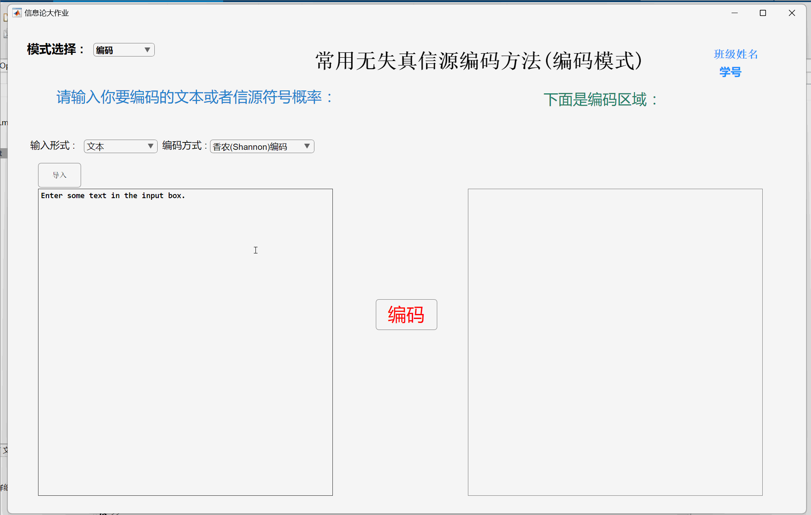
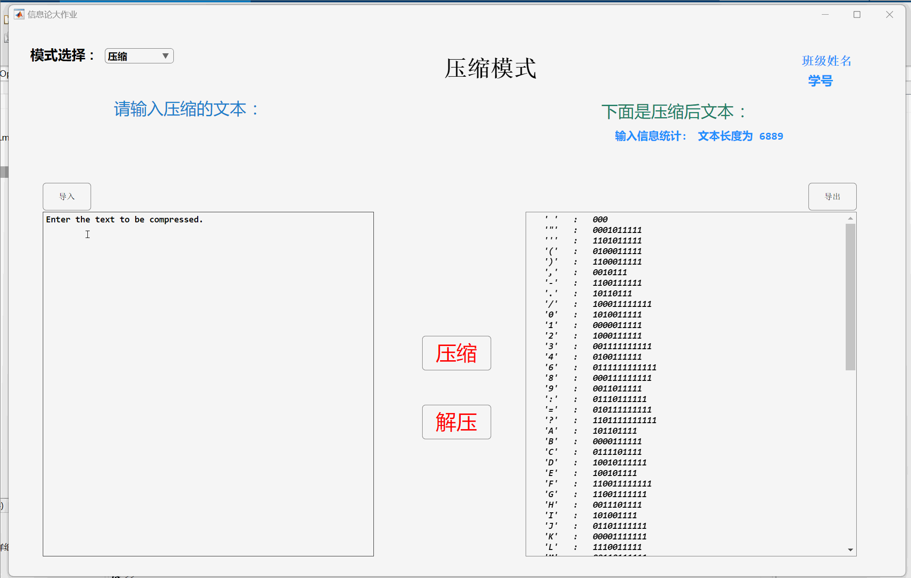

# 信息论基础项目 && Matlab实现

本项目是《信息论基础》课程的大作业，涵盖了常用无失真信源编码（如香农编码、费诺编码和哈夫曼编码）、简单加密解密算法，以及文本压缩解压功能的设计与实现。  
项目展示了信息论在高效数据处理和安全传输中的实际应用。

**详细报告** ：[Word报告](./报告.docx)

## 功能模块

### 编码
- 实现了香农编码、费诺编码和哈夫曼编码，用于高效表示信源数据，减少信息冗余。
- 支持计算信源熵、平均码长和编码效率等指标。  

### 加密/解密
- 基于简单的密钥混合算法，结合位运算和置换操作，实现文本加密和解密。
- 确保数据传输过程中的安全性，仅使用正确密钥可解密原文。  

### 压缩/解压缩
- 使用 **Lempel-Ziv-Welch（LZW）算法**对文本进行无损压缩，显著减少数据存储空间。
- 支持解压缩功能，可准确还原原始数据内容。  

## MATLAB 实现细节

本项目所有功能均通过 MATLAB 实现，涵盖以下核心模块：

1. **香农编码**  
   - 计算符号概率分布的熵值和码长。
   - 生成紧凑的香农码，确保高效表示。  
   示例函数：`shannon(pr)`。

2. **费诺编码**  
   - 基于符号概率进行递归分组，生成费诺码。
   - 动态计算编码效率，支持不同输入格式。  
   示例函数：`fano(pr)`。

3. **哈夫曼编码**  
   - 构建哈夫曼树，对符号生成前缀码。
   - 支持符号概率输入和文本输入两种形式。  
   示例函数：`huffman(pr)`。

4. **加密/解密**  
   - 基于 XOR 操作的对称加密，结合密钥调度算法。
   - 支持中文、英文等多语言文本处理。  
   示例函数：`Encrypt(text, key)` 和 `Decrypt(encryptedText, key)`。

5. **LZW 压缩/解压缩**  
   - 实现基于字典的动态编码算法，用于文本压缩和解压缩。
   - 适合大数据量的无损压缩需求。  
   示例函数：`compressTextLZW(text)` 和 `decompressTextLZW(compressedText)`。

6. **文件导入与导出**  
   - 文件读取：支持从 `.txt` 文件导入数据，进行编码、加密或压缩操作。
   - 文件保存：结果可导出为 `.txt` 文件，便于存档。  
   示例函数：`Import_Callback()` 和 `SaveCode_Callback()`。

## 文本导入与导出
- **导入功能**：支持从文件加载数据，适用于编码、加密和压缩操作。
- **导出功能**：操作结果可保存为 `.txt` 文件，方便存档和分享。

## 运行效果
- **编码**：将信源符号转换为紧凑表示，展示编码后的信息熵、平均码长及效率指标。
- **加密/解密**：加密文本安全可靠；正确密钥下可还原原始文本，保障信息机密性。
- **压缩/解压缩**：大幅压缩文本体积，同时保证数据的无损恢复。

---

**欢迎贡献代码和提出改进建议！**
